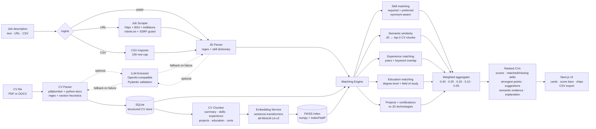

# AI Job-CV Matching Agent

> An end-to-end, explainable system that ingests CVs and job descriptions,
> ranks the best CV for each role, and shows **why** — combining structured
> parsing, hard constraint checks, semantic search over embeddings,
> rule-based scoring, and an optional LLM extraction layer.

[](#)
[](#)
[](#)
[](#)
[](#)
[](#)
[](#)
[](#)

---

## What it does

Upload a few CVs, paste a job description (or a job posting URL, or a CSV
of jobs), and the system returns a ranked list of candidates with a
transparent score breakdown — skill match, semantic similarity to the
JD, experience relevance, education fit, project/certification overlap —
plus matched and missing skills, strongest evidence bullets, and concrete
improvement suggestions.

## Demo

> _Screenshot placeholder — drop a `docs/screenshot.png` here once you
> have one._
>
> 

A short walkthrough:

1. **Upload CVs** (PDF / DOCX, multiple at once).
2. **Add a job description** — paste, paste a URL, or upload a CSV of
   jobs.
3. **See ranked CVs** with score bars, matched/missing skill chips,
   strongest evidence bullets, improvement tips, and a one-sentence
   plain-English explanation per CV.

## Why this project matters

Most "AI matchers" do one of two things: ① fuzzy keyword overlap with
zero explainability, or ② a single LLM call that hallucinates skills the
candidate doesn't have. Neither is something a real recruiter — or a
fine-tuned NLP engineer reviewing a portfolio — can trust.

This project combines:

- **Structured parsing** — the system extracts a typed `ParsedCV` /
  `ParsedJob` it can reason about.
- **Hard constraints** — required skills are checked explicitly so a
  10/10 semantic match without `Python` cannot beat a 7/10 candidate
  who actually has it.
- **Semantic search** — sentence-transformer embeddings + FAISS index
  catch paraphrases the rule-based layer misses ("led an ML team" ≈
  "managed a machine-learning group").
- **Explainable ranking** — every score is broken into five labelled
  sub-scores; every recommendation comes with the exact CV bullets that
  support it.
- **Optional LLM extraction** — drop in any OpenAI-compatible endpoint
  (OpenAI, vLLM, Ollama, LM Studio) for cleaner structured JSON, with
  graceful fallback to the rule-based parser when the model misbehaves.
- **Local fine-tuning prep** — a dataset builder + Unsloth/LoRA script
  ready to fine-tune a small open model (Qwen 0.5B/1.5B, Gemma-2-2B,
  Llama-3.2) on CV/JD extraction.

## Key features

- 📄 PDF and DOCX upload with section-aware parsing
- 🧩 Heuristic CV parser with contact / skills / education / experience /
  projects / certifications / languages extraction
- 📋 Heuristic JD parser covering 14 fields including salary, employment
  type, remote type, experience level, soft skills
- 🔎 Semantic search over CV chunks via sentence-transformers + FAISS
- 🧮 Five-factor weighted scoring (skill 40%, semantic 25%, experience
  20%, education 10%, projects 5%)
- 💬 Synonym-aware skill matching (`JS`≡`JavaScript`, `ML`≡`Machine
  Learning`, `LLMs`≡`Large Language Models`, `WP`≡`WordPress`, …)
- 🌐 Job-URL scraping that respects `robots.txt`, throttles per host,
  and falls back to manual paste
- 📊 CSV batch matching (best CV per row, exportable result table)
- 🤖 Optional OpenAI-compatible LLM extraction layer
- 🧪 Evaluation suite with field-level F1, top-1/top-3, MRR, constraint
  satisfaction
- 🧠 Fine-tuning dataset builder + Unsloth/LoRA training script
- 🐳 One-command Docker deployment with persistent volumes and
  health checks

## Architecture



## Tech stack

| Layer            | Tools                                                                                  |
|------------------|----------------------------------------------------------------------------------------|
| Frontend         | Next.js 14 (App Router), TypeScript, Tailwind CSS                                      |
| Backend          | FastAPI, Pydantic v2, SQLAlchemy 2.0, SQLite                                           |
| Parsing          | `pdfplumber`, `python-docx`, regex + section heuristics                                |
| Scraping         | `httpx`, `beautifulsoup4`, `trafilatura`, `urllib.robotparser`                         |
| NLP / embeddings | `sentence-transformers` (all-MiniLM-L6-v2), `numpy`                                    |
| Vector index     | `faiss-cpu` (`IndexFlatIP`) with numpy fallback                                        |
| Optional LLM     | OpenAI-compatible Chat Completions (OpenAI, vLLM, Ollama, LM Studio, Groq, Together)   |
| Fine-tuning prep | Unsloth + LoRA + TRL `SFTTrainer` (Qwen 0.5B/1.5B, Gemma-2-2B, Llama-3.2)              |
| Eval             | Hand-rolled F1 / top-1 / top-3 / MRR / constraint satisfaction over synthetic gold     |
| DevOps           | Docker + docker-compose, Makefile, persistent volumes, health checks                   |

## How it works

### CV ingestion

1. **Text extraction** — PDF via `pdfplumber`, DOCX via `python-docx`
   (tables included). Output is normalised whitespace + unicode.
2. **Section detection** — header line classifier (~40 variants:
   `Summary`, `Profile`, `Technical Skills`, `Work Experience`, `Personal
   Projects`, `Languages`, …).
3. **Field extraction** — per-section splitters (CSV-like for skills,
   bullet-aware for experience/projects), name guesser (top of doc, no
   contact tokens), contact extraction (email, phone, LinkedIn, GitHub,
   bare-domain portfolio).
4. Optional **LLM layer** — same input, structured JSON via the
   `llm_extraction_service` prompt. Pydantic-validated. Falls back to
   the heuristic parser on any failure.

### JD ingestion

- Direct paste → cleaned + section-walked.
- URL → fetched politely (per-host throttle, `robots.txt` check, SSRF
  guard, 2 MB cap), JSON-LD `JobPosting` is preferred when available;
  body extracted via `trafilatura` or BS4 fallback.
- CSV → header-validated, `description` column required, 100-row cap.

### Matching engine

For each (CV, JD) pair the matcher computes **five sub-scores in
[0, 100]** and aggregates them:

```
overall = 0.40 · skill
        + 0.25 · semantic
        + 0.20 · experience
        + 0.10 · education
        + 0.05 · project
```

Each score is calibrated and explainable:

| Sub-score   | Logic                                                                                                            |
|-------------|------------------------------------------------------------------------------------------------------------------|
| skill       | Synonym-aware set match. Required skills weighted 0.75, preferred 0.25. Fuzzy ratio ≥ 0.88 catches typos.        |
| semantic    | `EmbeddingService.similarity(JD, top-3 CV chunks)` — cosine of normalised vectors. BoW fallback when neural off. |
| experience  | `0.6 × years + 0.4 × keyword overlap`. Years from "X+ years" / year ranges in CV experience entries.             |
| education   | Degree-rank ladder (PhD > Masters > Bachelor > Diploma) plus field-of-study match (CS, AI, Robotics, …).         |
| project     | Fraction of JD technologies referenced in CV projects + certifications, with bonus when projects are present.    |

Plus, per CV: **matched_skills**, **missing_skills**, **strongest_points**
(top-3 CV bullets that mention a matched skill), **improvement_suggestions**
(35+ skill-specific templates), and a **one-sentence explanation** that
reads like something a human reviewer would write.

Ranking is **deterministic** — same inputs always produce the same
ordering. Sort key: `(-overall_score, -skill_score, cv_id)`.

## RAG / vector search

The semantic layer is a small but real RAG:

1. On CV upload, the **chunker** breaks each CV into typed chunks:
   `summary`, `skills`, `experience`, `project`, `education`,
   `certification`, `languages`. One vector per chunk.
2. The **embedder** uses `sentence-transformers/all-MiniLM-L6-v2`
   (configurable via `APP_EMBEDDING_MODEL`) and L2-normalises so dot
   product equals cosine similarity.
3. The **vector store** holds a canonical numpy matrix plus a per-CV
   row map. A **FAISS `IndexFlatIP`** is mirrored for fast global
   search; numpy is the fallback when FAISS isn't installed.
4. At match time, the JD is embedded and we take the **top-3 cosine
   similarities** between the JD vector and that CV's chunk vectors —
   the mean becomes the semantic score, and the top chunks are returned
   as `top_semantic_matches` (UI shows them as "evidence").
5. A standalone `POST /api/search/semantic` endpoint exposes the same
   index for free-text queries.

Every layer **degrades gracefully**: without the neural deps installed,
the matcher swaps in BoW cosine on full texts. The endpoints surface
this with `503` + actionable instructions, never a 500.

## Optional LLM extraction

Drop in any OpenAI-compatible endpoint and the system will use it for
JSON extraction:

```bash
export USE_LLM_EXTRACTION=true
export OPENAI_API_KEY=sk-...
# Optional — point at any compatible server:
export OPENAI_BASE_URL=https://api.openai.com/v1
export LLM_MODEL_NAME=gpt-4o-mini
```

The implementation is deliberately defensive:

- Strict JSON-only prompts with `response_format={"type":"json_object"}`.
- Pydantic schema validation on the response.
- Code-fence stripping on the off-chance the model wraps JSON in
  markdown.
- Configurable timeout (`LLM_TIMEOUT_SECONDS`).
- Falls back to the heuristic parser on **any** failure (bad key,
  network error, timeout, invalid JSON, schema violation).
- Logs which path ran every call:
  `INFO ai_job_cv_matcher.extraction — JD extraction: LLM (model=gpt-4o-mini)`.
- Frontend never sees the API key.

## Fine-tuning preparation

The `training/` module is the bridge from "OpenAI-compatible API works"
to "I own this thing end-to-end."

- **`build_dataset.py`** — exports CVs from the SQLite DB, jobs from CSV,
  or bundled synthetic samples into instruction-tuning JSONL records:
  ```json
  {"instruction": "...", "input": "<raw text>", "output": "<JSON>"}
  ```
- **`validate_dataset.py`** — JSON / key / schema validation that runs in CI.
- **`finetune_json_extractor_unsloth.py`** — a hybrid script + notebook
  for Unsloth + LoRA + `SFTTrainer`, ready for **Colab T4**:
  - Default model: `unsloth/Qwen2.5-1.5B-Instruct-bnb-4bit`.
  - LoRA rank 16, gradient checkpointing, AdamW-8bit, fp16.
  - Greedy-decoded smoke test that asserts `json.loads` parses the
    output.
  - Optional merged 16-bit export for vLLM / Ollama / LM Studio.
- **Adapter → backend** — the trained model serves at any
  OpenAI-compatible endpoint and slots straight into the LLM extraction
  layer above. No backend code change needed.

## Installation

### Prerequisites

- Python 3.11+
- Node 20+ (for the frontend)
- (Optional) Docker 24+ if you prefer containerised development

### Local install

```bash
git clone https://github.com/<your-handle>/ai-job-cv-matcher.git
cd ai-job-cv-matcher

# Backend
cd backend
python -m venv .venv && source .venv/bin/activate
pip install -r requirements.txt

# Frontend
cd ../frontend
cp .env.local.example .env.local       # set NEXT_PUBLIC_API_URL if needed
npm install
```

## Running locally

Two terminals (or one `make dev`):

```bash
# Terminal 1 — backend
make backend
# → http://127.0.0.1:8000  (Swagger at /docs)

# Terminal 2 — frontend
make frontend
# → http://localhost:3000
```

Or both at once:

```bash
make dev
```

### Test with sample data

The repo ships two synthetic demo CVs you can drop into a fresh DB
without uploading anything:

```bash
make seed
# Seeded 2 demo CV(s); 0 already present.
```

Then paste any of the JDs from `evaluation/sample_matching_gold.jsonl`
into the UI textarea and click **Analyse Job Match** to see the full
ranking pipeline in action.

## Running with Docker

```bash
cp .env.example .env
make docker-up
# Backend  → http://localhost:8000
# Frontend → http://localhost:3000
```

### Port already in use?

If `3000` or `8000` is taken on your machine, use the auto-picker:

```bash
make docker-up-auto
# Probes 3000/8000, walks to the next free port for each side, writes
# .env.ports, and prints the resolved URLs. Volumes are unaffected.
```

The picker also rewrites `BACKEND_CORS_ORIGINS` and `NEXT_PUBLIC_API_URL`
to match — so the frontend keeps talking to the right backend regardless
of which ports got picked.

You can also override manually:

```bash
FRONTEND_PORT=3001 BACKEND_PORT=8001 \
  NEXT_PUBLIC_API_URL=http://localhost:8001 \
  BACKEND_CORS_ORIGINS=http://localhost:3001 \
  docker compose up --build
```

Or kill whatever's holding the port:

```bash
lsof -nP -iTCP:3000 -sTCP:LISTEN     # see PID
kill <PID>
```

### Volumes

Volumes persist the SQLite DB, uploaded CVs, the FAISS index, and the
HuggingFace model cache across restarts:

| Volume         | Mounted at        | Holds                                  |
|----------------|-------------------|----------------------------------------|
| `backend_data` | `/data`           | `app.db`, uploads, FAISS vectors       |
| `hf_cache`     | `/data/hf_cache`  | sentence-transformers model cache      |

`make docker-down` keeps volumes; `make docker-clean` wipes them.

## API endpoints

Base URL: `/api`

| Method | Path                       | Purpose                                                    |
|--------|----------------------------|------------------------------------------------------------|
| GET    | `/health`                  | Liveness check                                             |
| POST   | `/cvs/upload`              | Multipart upload (PDF/DOCX, multi-file)                    |
| GET    | `/cvs`                     | List uploaded CVs                                          |
| GET    | `/cvs/{id}`                | Fetch a single CV                                          |
| DELETE | `/cvs/{id}`                | Delete a CV (and its vector chunks)                        |
| POST   | `/jobs/parse`              | Parse a pasted JD into structured fields                   |
| POST   | `/jobs/from-url`           | Scrape + parse a public JD URL                             |
| POST   | `/jobs/from-file`          | Extract a JD from a PDF/DOCX/TXT upload                    |
| POST   | `/jobs/import-csv`         | Validate + parse a multi-job CSV (no matching)             |
| POST   | `/match`                   | Rank all uploaded CVs against a JD                         |
| POST   | `/match/from-url`          | Scrape a JD URL, then rank all CVs                         |
| POST   | `/match/from-file`         | Extract from PDF/DOCX/TXT, then rank all CVs               |
| POST   | `/match/single`            | Score one CV against a JD                                  |
| POST   | `/match/batch-csv`         | Best CV per row of an uploaded CSV                         |
| POST   | `/embeddings/rebuild`      | Drop + rebuild the FAISS index from current CVs            |
| POST   | `/search/semantic`         | Free-text semantic search over CV chunks                   |
| POST   | `/profile/build`           | (Re)build the unified user profile (PDF/DOCX/TXT optional) |
| GET    | `/profile`                 | Fetch the current unified profile                          |
| DELETE | `/profile`                 | Drop the unified profile (CVs untouched)                   |
| GET    | `/profile/queries`         | Smart job-search queries + grouped + platform tags         |
| POST   | `/jobs/discover`           | Discover jobs from public, no-login JSON APIs (RemoteOK / Remotive / HN) |
| POST   | `/jobs/rank`               | Rank a batch of jobs against the CV pool (or unified profile)             |
| POST   | `/tailor`                  | Pick best CV + structured tailoring suggestions for one job description    |
| POST   | `/agent/run`               | End-to-end pipeline: profile → tags → discover → rank → tailor             |
| POST   | `/generate`                | CV suggestions + cover letter + LinkedIn message (LLM polish optional)     |
| GET    | `/cv/library`              | Read the editable CV library                                                |
| PUT    | `/cv/library`              | Replace the CV library                                                      |
| POST   | `/cv/render`               | Render a JD-tailored LaTeX CV (and PDF when `tectonic` is available)        |

Full Swagger UI at `/docs` once the backend is running.

## Example input/output

**Input** — JD (excerpt):

```text
Job Title: Senior AI Engineer
Company: Cortex Labs
Location: Berlin (Hybrid)
Required skills: 5+ years Python, ML, NLP, RAG, FAISS, PyTorch, Docker, AWS
Preferred: TypeScript, Next.js
Education: Master's in Computer Science.
```

**Output** (one record from `POST /api/match`):

```json
{
  "cv_id": 1,
  "cv_name": "Alice Strong",
  "filename": "alice.pdf",
  "overall_score": 82.7,
  "skill_score": 100.0,
  "semantic_score": 78.4,
  "experience_score": 77.8,
  "education_score": 100.0,
  "project_score": 42.2,
  "matched_skills": ["Python", "Machine Learning", "NLP", "RAG", "FAISS", "PyTorch", "Docker", "AWS", "TypeScript", "Next.js"],
  "missing_skills": [],
  "strongest_points": [
    "Senior AI Engineer — Acme. Built RAG pipelines and shipped FastAPI services on AWS using Python."
  ],
  "improvement_suggestions": [
    "Strong alignment overall — consider quantifying impact in bullet points."
  ],
  "explanation": "This CV is a strong match for Senior AI Engineer because it includes Machine Learning, RAG, and Python, and there are no major skill gaps.",
  "top_semantic_matches": [
    {"kind": "experience", "text": "Senior AI Engineer — Acme. Built RAG pipelines …", "score": 0.81},
    {"kind": "skills",     "text": "Python, FastAPI, Machine Learning, RAG, FAISS …",   "score": 0.72}
  ]
}
```

## Evaluation metrics

The `evaluation/` module measures both layers on a versioned synthetic
gold set:

**Extraction** (`evaluate_extraction.py`)
- Field-level **precision / recall / F1** over canonicalised sets.
- Skill-only macro P/R/F1 (broken out — most impactful field).
- Scalar exact-match rate (case-insensitive; `location` allows
  substring; `summary` reports a token-overlap ratio).
- Missing-required-fields count.

**Matching** (`evaluate_matching.py`)
- **Top-1 accuracy** — predicted top CV equals expected top CV.
- **Top-3 accuracy** — expected top CV in predicted top 3.
- **Mean Reciprocal Rank** of the expected top CV.
- **Constraint satisfaction rate** — fraction of records where every
  declared constraint passes (`top1_must_be`, `min_top1_score`).
- **Average score gap** (top1 − top2) — separability signal.

Both produce JSON + Markdown reports under `evaluation/reports/`. Run:

```bash
make eval
```

Sample output on the bundled synthetic gold:

```text
Top-1 accuracy:                 1.000
Top-3 accuracy:                 1.000
Mean Reciprocal Rank:           1.000
Constraint satisfaction rate:   1.000
Avg score gap (top1 − top2):   45.25
```

## Limitations

- Heuristic parsers excel on well-structured CVs/JDs; weird two-column
  PDFs or scanned-image CVs need OCR (not yet wired).
- The default semantic model is small (`all-MiniLM-L6-v2`, 384 dims) —
  fast and free, but a domain-tuned model would lift recall on niche
  skills.
- Job-URL scraping cannot bypass logins, JS-rendered content, paywalls,
  or anti-bot challenges. Manual paste is always the fallback.
- Evaluation uses a small synthetic gold set; numbers are illustrative,
  not benchmarks.
- LLM extraction depends on the chosen endpoint's reliability — that's
  why every failure mode falls back to the rule-based parser.

## Future improvements

- OCR fallback for scanned CVs (Tesseract or PaddleOCR).
- Multilingual CV support via `paraphrase-multilingual-MiniLM-L12-v2`.
- Real fine-tuned local model swap-in (the prep is done; the training
  run is one Colab notebook away).
- Per-user authentication and a multi-tenant CV library.
- A learning-to-rank head that combines the five sub-scores using
  recruiter feedback as labels.
- Streaming generation in the LLM extractor for lower TTFB.
- Recruiter-facing analytics (how often is each skill the deciding
  factor, etc.).

## Privacy and ethical notes

- **CVs and the FAISS index are personal data.** They live in a Docker
  volume. Back them up like a database; don't commit them.
- The optional LLM extraction layer **runs server-side only** —
  `OPENAI_API_KEY` never leaves the backend.
- The job-URL scraper:
  - respects `robots.txt`,
  - throttles per host,
  - rejects local / private / loopback addresses (basic SSRF guard),
  - does **not** bypass logins, paywalls, CAPTCHAs, or anti-bot systems,
  - and falls back to manual paste with a clear error.
- The bundled synthetic samples (`evaluation/`, `training/data/synthetic/`)
  are hand-written placeholder data — safe to publish.
- This is a portfolio / personal-job-search tool. It is not a hiring
  decision-making system. Use it as a triage aid, not as ground truth.

## Author

Built by **<your name>** as a portfolio project for **AI Engineer**,
**NLP Engineer**, **RAG Engineer**, and **Full-stack AI Developer**
roles.

- LinkedIn: <https://www.linkedin.com/in/your-handle>
- GitHub:   <https://github.com/your-handle>
- Email:    you@example.com

If you found this useful or want to talk about RAG, fine-tuning, or
recruiter tooling — get in touch.

---

Each subsystem has its own deep-dive README:

- [`backend/README.md`](backend/README.md) — endpoints, scoring, LLM
  layer, scraper, CSV import.
- [`frontend/README.md`](frontend/README.md) — UI structure, env, flows.
- [`training/README.md`](training/README.md) — dataset prep + Unsloth
  fine-tune.
- [`evaluation/README.md`](evaluation/README.md) — metrics and gold sets.
- [`CONTRIBUTING.md`](CONTRIBUTING.md) — how to add features without
  breaking the test suite.
